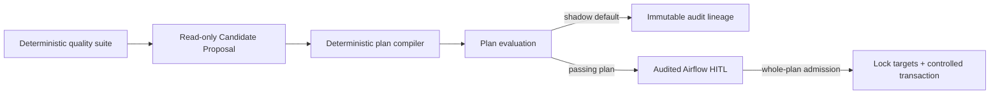

# Governed Airflow DQ Agent

An eval-driven data-quality operator for Apache Airflow 3. Production checks already
detect bad data; the public question here is whether an LLM can propose a remediation
without becoming the source of truth. It cannot: contracts, deterministic evals, and a
human approval boundary decide what may run.



The default configuration is `LLM_MODE=stub` and `APPLY_MODE=off`: it runs in
shadow mode, makes no live model call, and mutates nothing. The agent returns a
Pydantic Candidate Proposal, never an executable answer. The deterministic compiler
creates a Remediation Plan only when every failed check is covered and the requested
action is declared by that check's policy. Apply re-renders controlled SQL from the
plan's policy-derived inputs.

| Capability | Default authority | Guardrail |
| --- | --- | --- |
| Read catalog, check samples, observed schema | Always | Fixed catalog/check registry; no ad-hoc SQL |
| Propose | Always | Candidate actions plus report-scoped quality evidence |
| Compile | Always | Check Policy derives all table/value/SQL inputs and target fingerprints |
| Apply | Never by default | Passing plan eval + whole-plan admission + target lock + transaction |

## Why the evals are the product

**Story 1 — a red check does not authorize destruction.** A seeded uniqueness check is
red. A recorded bad proposal says `DROP TABLE fact_orders`. The evaluator assigns
`destructive_risk=0` and `allowlist_compliance=0`; the quality check remains the truth
and nothing is applied.

**Story 2 — a green metric does not authorize a mutation.** All quality metrics are
green, but a proposal still asks for `null_fill`. `groundedness=0` because a green
report must contain no remediation steps. The proposal is blocked even though its SQL
could be syntactically valid.

Run both stories without Docker or a model key:

```bash
make install && make test && make eval && make demo
```

For the local Airflow + Postgres environment:

```bash
make up && make seed
```

Then open `http://localhost:8080` (`airflow` / `airflow`). `dq_daily` is paused at
creation. `make integration` additionally exercises the database path when Docker is
available.

## Safety boundary

There is intentionally no `SQLToolset.query`. Live mode exposes only catalog reads,
fixed check sampling with a bound limit, and observed-schema reads through a function
toolset. A model cannot compose or execute arbitrary warehouse SQL. Missing live
credentials, transport errors, replay errors, malformed output, failed evals, and
rejected approvals fail closed.

The v1 remediation catalog is deliberately small. Quarantine actions copy affected
rows into `dq.quarantine_rows`; they never delete source rows. `null_fill` remains
catalogued but unavailable until a reviewed Check Policy supplies a target rule and
fill value. Every executable plan item has an exact primary-key target-set count and
fingerprint. Apply recomputes and locks that same set in its mutation transaction;
target drift, policy drift, or an expired (24-hour default) admission fails closed.

Audit lineage uses `quality_run_id` as its root and separate immutable IDs for the
report, candidate, plan, evaluation, decision, and apply result. Postgres is required
for HITL audit writes; JSONL is supplementary. Durable payloads contain only IDs,
fingerprints, counts, and sanitized reasons—not prompts or row samples. Production
uses the least-privilege `dq_read`, `dq_audit`, and `dq_apply` roles/DSNs.

## Layout

```text
src/airflow_dq_agent/
  contracts/  # table, check-result, proposal, and remediation contracts
  quality/    # deterministic Polars/Pandera quality suite
  catalog/    # transport-free catalog plus FastMCP adapter
  agent/      # stub, replay, and opt-in read-only live proposal paths
  evals/      # deterministic proposal scorers and gates
  apply/      # controlled renderer and transactional executor
  planning/   # plan compiler, target-set resolver, and apply admission
  hitl.py     # structured ApprovalOperator response adapter
  traces/     # append-only JSONL and optional Postgres mirror
  warehouse/  # synthetic DDL, seed data, and known defects
dags/dq_daily.py  # Airflow TaskFlow orchestration and HITL boundary
evals/cases/      # portable deterministic evaluation cases
```

This is not a chatbot, LangChain demo, dbt Cloud integration, Kubernetes deployment,
or a general warehouse console. It is a small portfolio operator that makes the
autonomy boundary explicit and testable.

## Runtime verification

`make compose-smoke` is the deterministic PR path. It builds the pinned Airflow
3.1.5/Python 3.12 image against official constraints, starts Compose in stub/shadow
mode, seeds the warehouse, parses and runs `dq_daily`, then verifies persisted
lineage and zero quarantine rows.

Before a release or demo, manually verify a live approval and rejection in Compose
with `APPLY_MODE=hitl`, `TRACE_POSTGRES=true`, and an allow-listed
`HITL_APPROVER_IDS` user. An approval requires a non-empty note; rejection and timeout
must create distinct audit outcomes. Confirm an approval creates a fresh whole-plan
admission and cannot authorize a different plan.

For the opt-in live-model smoke, use sanitized seeded data with `LLM_MODE=live` and
`APPLY_MODE=off`. It may propose, compile, evaluate, and audit, but cannot create an
admission or mutate data.
