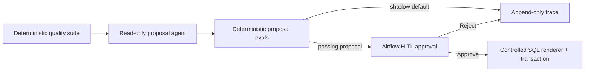

# Governed Airflow DQ Agent

An eval-driven data-quality operator for Apache Airflow 3. Production checks already
detect bad data; the public question here is whether an LLM can propose a remediation
without becoming the source of truth. It cannot: contracts, deterministic evals, and a
human approval boundary decide what may run.



The default configuration is `LLM_MODE=stub` and `APPLY_MODE=off`: it runs in
shadow mode, makes no live model call, and mutates nothing. The agent returns a
Pydantic `Proposal`, never an executable answer. Apply re-renders from the action ID
and contract-backed parameters; `sql_preview` is only for a reviewer.

| Capability | Default authority | Guardrail |
| --- | --- | --- |
| Read catalog, check samples, observed schema | Always | Fixed catalog/check registry; no ad-hoc SQL |
| Propose | Always | Structured `Proposal` plus allow-list eval |
| Apply | Never by default | Passing eval + one proposal-level HITL approval + transaction |

## Why the evals are the product

**Story 1 — a red check does not authorize destruction.** A seeded uniqueness check is
red. A recorded bad proposal says `DROP TABLE fact_orders`. The evaluator assigns
`destructive_risk=0` and `allowlist_compliance=0`; the quality check remains the truth
and nothing is applied.

**Story 2 — a green metric does not authorize a mutation.** All quality metrics are
green, but a proposal still asks for `null_fill`. `groundedness=0` because a green
report must contain no remediation steps. The proposal is blocked even though its SQL
could be syntactically valid.

Run both stories without Docker or a model key:

```bash
make install && make test && make eval && make demo
```

For the local Airflow + Postgres environment:

```bash
make up && make seed
```

Then open `http://localhost:8080` (`airflow` / `airflow`). `dq_daily` is paused at
creation. `make integration` additionally exercises the database path when Docker is
available.

## Safety boundary

There is intentionally no `SQLToolset.query`. Live mode exposes only catalog reads,
fixed check sampling with a bound limit, and observed-schema reads through a function
toolset. A model cannot compose or execute arbitrary warehouse SQL. Missing live
credentials, transport errors, replay errors, malformed output, failed evals, and
rejected approvals fail closed.

The v1 remediation catalog is deliberately small. Quarantine actions copy affected
rows into `dq.quarantine_rows`; they never delete source rows. `null_fill` binds a
contract-typed value and can execute only after whole-proposal approval. Every agent
run is appended to `traces/agent-traces.jsonl`; optional Postgres mirroring happens
after that local append, so local evidence survives a mirror outage.

## Layout

```text
src/airflow_dq_agent/
  contracts/  # table, check-result, proposal, and remediation contracts
  quality/    # deterministic Polars/Pandera quality suite
  catalog/    # transport-free catalog plus FastMCP adapter
  agent/      # stub, replay, and opt-in read-only live proposal paths
  evals/      # deterministic proposal scorers and gates
  apply/      # controlled renderer and transactional executor
  traces/     # append-only JSONL and optional Postgres mirror
  warehouse/  # synthetic DDL, seed data, and known defects
dags/dq_daily.py  # Airflow TaskFlow orchestration and HITL boundary
evals/cases/      # portable deterministic evaluation cases
```

This is not a chatbot, LangChain demo, dbt Cloud integration, Kubernetes deployment,
or a general warehouse console. It is a small portfolio operator that makes the
autonomy boundary explicit and testable.
